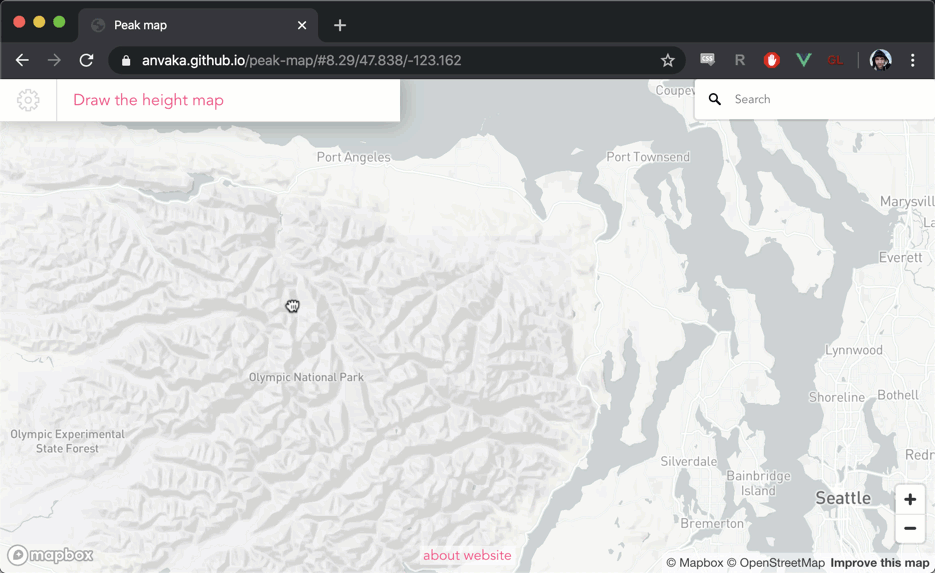
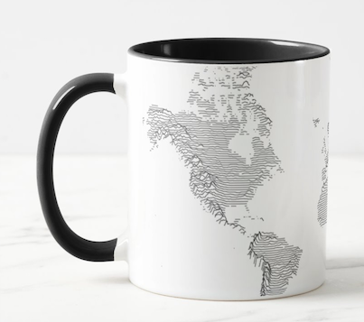

# Peak map

[This website](https://anvaka.github.io/peak-map) allows you to visualize elevation of any area on the map with 
filled area charts (also known as a `ridgeline`):

# How?

I'm using MapBox GL to draw the map. Once the area is selected, I'm using [elevation data](https://docs.mapbox.com/help/troubleshooting/access-elevation-data/) API from the MapBox.

The rendering of the lines is done on canvas overlay, [using regular 2D canvas context](https://github.com/anvaka/peak-map/blob/master/src/lib/createHeightMapRenderer.js).

## Bonus

You can print the final map onto a mug if you like the result:

To do this, draw the heightmap, close the settings window, and click on the small fly-out menu.

See the video demo here: https://twitter.com/anvaka/status/1207352229885181952
